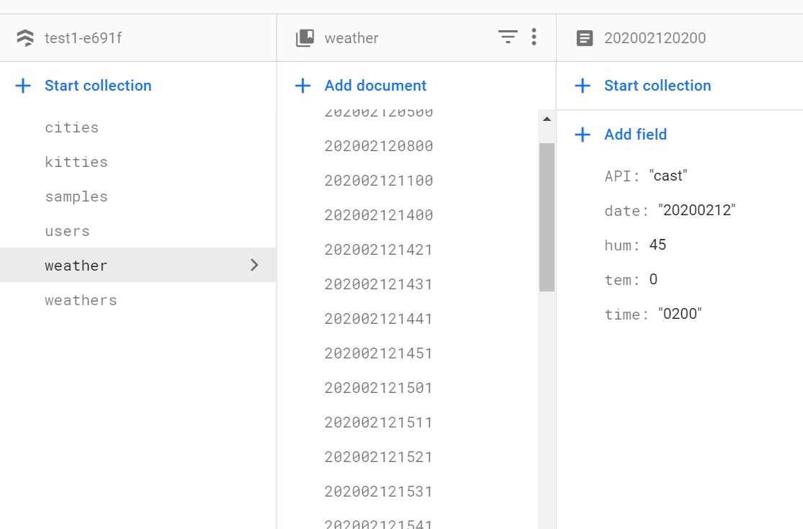
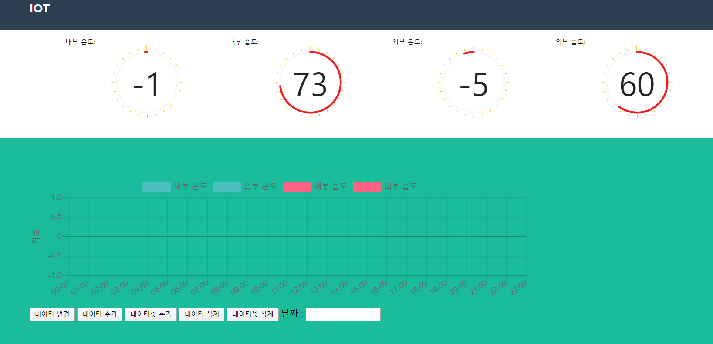

## Firebase를 이용한 바깥 공기 실내공기 비교 측정

* node js 서버에서 4시간마다 기상청 api를 가지고 와서 파이어베이스에 온도와 습기를 저장한다.
* iot 장비를 통해 실내 온도 측정, 습기를 측정해서 10분마다 파이어베이스 클라우드 스토어에 저장한다. 

* 프런트에서 기상청, iot 장비데이터를 가져와서 온도계를 보여준다.
* 그래프에서 기간별로 온,습도 데이터를 보여준다. 

파이어베이스 기상청 자료

웹 프런트 이미지 

